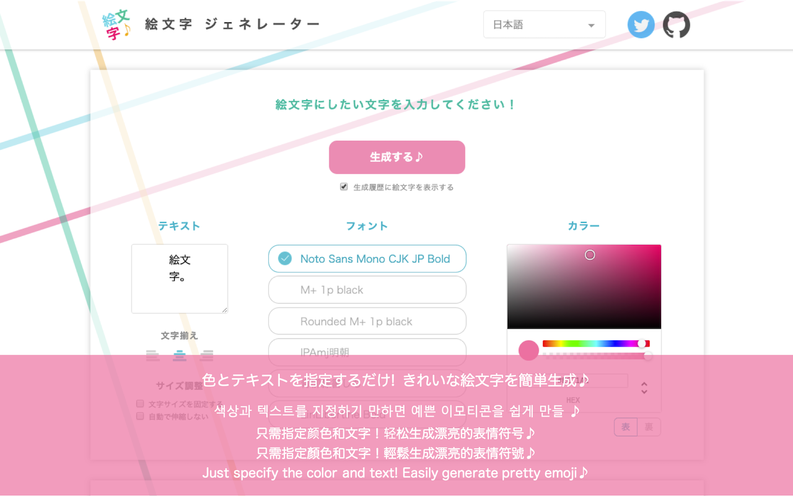

## Browser Extension for Emoji Generator

[](https://greenkeeper.io/)
[](https://circleci.com/gh/emoji-gen/browser-extension/tree/master) [](https://david-dm.org/emoji-gen/browser-extension) [](https://david-dm.org/emoji-gen/browser-extension?type=dev)

:tada: Ultimate Browser Extension

<br>&nbsp;

## Requirements

- Node `$(cat .node-version)`
- [Yarn](https://yarnpkg.com/)

## Getting Started

```
$ yarn
$ yarn start     # for development
$ yarn run build # for production
```

Next, please load `dist` directory as browser extension on Chrome or Firefox.

## Supported Browsers
Microsoft Edge is not supported, because Edge's WebExtensions support is incomplete.

- Google Chrome
  - https://chrome.google.com/webstore/detail/ghbhakkknnmocmiilhneahbkiaegdnmf?hl=ja&gl=JP
- Firefox
  - https://addons.mozilla.org/ja/firefox/addon/emoji-generator/

## License

MIT &copy; [Emoji Generator](https://emoji.pine.moe/)
